# Genetic Algorithms 遗传算法

The leap from natural evolution to intelligent optimization 从自然进化到智能优化的跨越

小组成员：_郑植_ <a href="https://github.com/elebirds" class="ns-c-iconlink"><mdi-open-in-new /></a>，黄启林，崔建辉，黄哲*

19th, Nov 2024

</br>
</br>

*其中崔建辉负责模式定理的数学理论部分，黄启林负责精英策略与格雷码的改进，黄哲负责背包算法Demo，郑植负责统筹与其余所有部分。
---
layout: side-title
side: left
color: amber
titlewidth: is-3
align: rm-lm
---

:: title ::

# <mdi-math-integral-box /> 目录

contents


:: content ::

1. 启发式算法的起源：P与NP问题
2. 进化论与遗传算法
3. 代码求解的简单示例
4. 算法的理论基础：模式定理与收敛性分析
5. 遗传算法的进一步改进
6. 实践：求解经典旅行商问题（TSP）

---
layout: side-title
color: amber
align : rm-lm
titlewidth: is-3
---

:: title ::

# About Genetic Algorithms

:: content ::

John Holland 和他的合作者在 20 世纪 60 年代和 70 年代，基于达尔文的==自然选择==理论的生物进化模型，开发了遗传算法（Genetic algorithm，GA）。

其将自适应和人工系统研究中使用==交叉、重组、变异和选择==作为解决问题的策略，这些遗传算子构成遗传算法的基本部分。

从那以后，遗传算法的许多变体被开发出来，并且被应用于各种各样的优化问题，从图着色到模式识别，从离散系统（如旅行商问题）到连续系统（如航空航天工程领域，翼型的有效设计），从金融市场到多目标工程优化。

---
layout: top-title-two-cols
color: violet
align: l-lt-lt
---

:: title ::
# 最优化问题

:: left ::
## 连续优化

其特点是变量的取值是连续的，或者说是变量的范围是实数域 (绝大多数情况)。对于一个可行域，其中包含着无数个可行解。

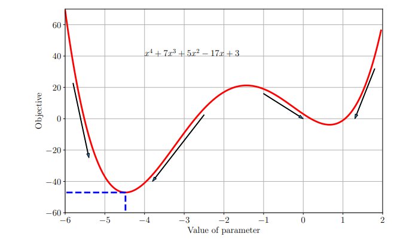

这类问题一般利用目标函数可导的性质，通过如梯度，海塞矩阵等进行求解（如常见的梯度下降法，牛顿法等）。

:: right ::
## 组合优化

相对于连续优化的另外一种优化是组合优化，组合优化的变量是离散的，也就是变量的空间只有有限多个的可行解。

典型的组合优化问题包括旅行商问题（TSP）、最小生成树问题（MST）和背包问题。

以背包问题为例，给你物品列表，选择一些物品，使得其总价值最大，但是总重量不超过背包的容量。

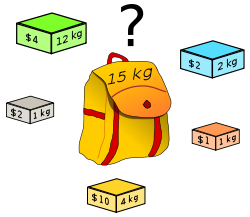


---
layout: top-title
color: violet
---

:: title ::
# P与NP

:: content ::

很容易想到的是穷举法。对于每一个物品，放入背包编码为 $1$，不放入背包编码为 $0$，那么对于 $n$ 个物品，就有 $2^n$ 种可能的解，假设计算价值的函数复杂度为 $O(n)$，那么穷举法的复杂度为 $O(n2^n)$，无法在多项式时间复杂度内解决。

这就引出了计算复杂度理论中的 P 与 NP 问题。

- 多项式复杂度(polynomial complexity)：$\mathcal{O}(n^k), k \in \mathbb{N}$

- **P问题**：能够在多项式时间内找到解的问题。
- **NP问题**(Non-deterministic Polynomial time)：无法在多项式时间内找到解，但是可以在多项式时间内验证解是否正确的问题。（如大素数的判断）
- **NP困难问题**：所有的NP问题都可以在多项式时间内归约到该问题，但是该问题本身不一定是NP问题；未必可以在多项式时间内验证解是否正确。

实际上，大多数的组合优化问题都是 NP-hard 问题，虽然存在着某些特殊问题可以用多项式时间的方法来解决。

最优算法的计算时间使人无法忍受或因问题的难度使其计算时间随问题规模的增加以指数速度增加，我们只能退而求其次，寻找一个近似解。

---
layout: top-title-two-cols
color: violet
---

:: title ::
# 启发式算法

:: left ::

***启发式算法 (Heuristic Algorithms)*** 是相对于最优算法提出的。一个问题的最优算法是指求得该问题每个实例的最优解. 

<Admonition title="启发式算法的一种定义" color='amber-light'>
一个基于直观或经验构造的算法，在可接受的花费 (指计算时间、占用空间等) 下给出待解决组合优化问题每一个实例的一个可行解，该可行解与最优解的偏离程度不一定事先可以预计。
</Admonition>


> 这一类算法都是从自然现象中得到启发的。
> 
> ***模拟退火***：从金属加热后再冷却，金属中的分子最终有可能会到达一个内能比原来更低的位置，表示为一个更优解；
> 
> ***蚁群算法和粒子群算法***：通过一个群体去搜索最优解，如对于非凸的优化，往往具有多个局部最优解，通过一个群体去搜索能够扩大搜索范围，从而以更大的概率收敛于全局最优解。

- 优点：算法简单直观，易于修改；能在可接受的时间内给出一个较优解。
- 缺点：不能保证为全局最优解；算法不稳定，性能取决于具体问题和设计者经验。

:: right ::
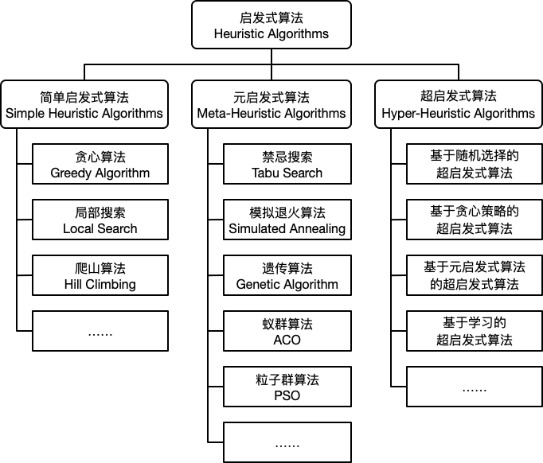

---
layout: top-title-two-cols
color: cyan
---

:: title ::
# 基本思想：达尔文的进化论

:: left ::
生物在其延续生存的过程中，逐渐适应其生存环境，使得其品质不断得到改良，这种生命现象称为 **进化(Evolution)** 。

生物的进化是以集团的形式共同进行的，这样的一个团体称为 **种群(Population)** ，组成种群的单个生物称为 **个体(Individual)** ，每个个体对其生存环境都有不同的适应能力，这种适应能力称为个体的 **适应度(Fitness)** 。

按照达尔文的进化论，那些具有较强适应环境变化能力的生物个体具有更高的生存能力，容易存活下来，并有较多的机会产生后代；相反，具有较低生存能力的个体则被淘汰，或者产生后代的机会越来越少，直至消亡。

即“==自然选择，适者生存==”。通过这种自然的选择，物种将逐渐向适应于生存环境的方向进化，从而产生优良的物种。

:: right ::
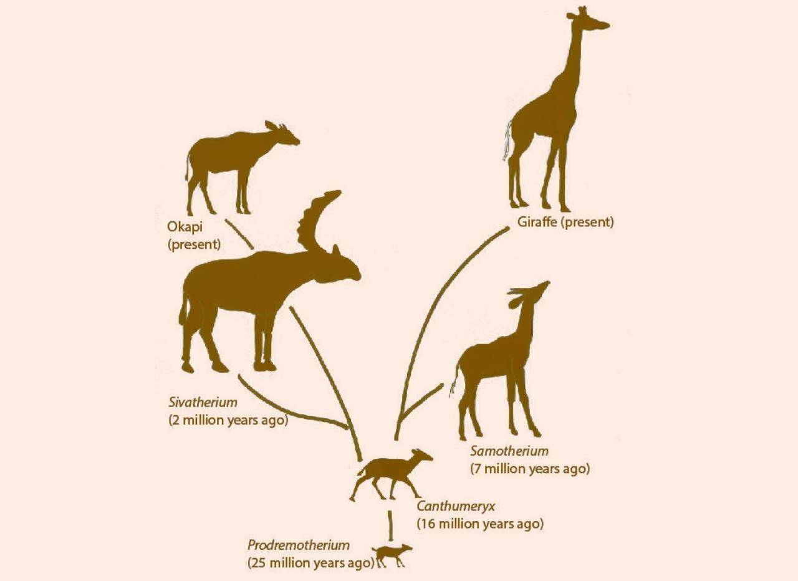

---
layout: top-title-two-cols
color: cyan
---

:: title ::
# 基本思想：基因与遗传学

:: left ::
生物从其亲代继承特性或性状，这种生命现象就称为 **遗传(Heredity)** ，研究这种生命现象就称为 **遗传学(Genetics)** 。

由于遗传的作用，使得人们可以种瓜得瓜、种豆得豆，也使得鸟仍然在天空中飞翔，鱼仍然在水中遨游。

构成生物的基本结构和功能单位是 **细胞(Cell)** 。细胞中含有一种微小的丝状化合物，称为 **染色体(Chromosome)** ，生物的所有遗传信息都包含在这个复杂而又微小的染色体中。

染色体主要由蛋白质和脱氧核糖核酸(DNA)组成。控制生物遗传的物质单元称为 **基因(Cene)** 它是有遗传效应的DNA片段。生物的各种性状由其相应的基因所控制。

:: right ::

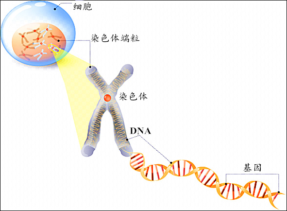

---
layout: top-title-two-cols
color: cyan
---

:: title ::
# 基本思想：基因与遗传学
:: left ::

细胞在分裂时，遗传物质DNA通过复制而转移到新产生的细胞中，新细胞就继承了旧细胞的基因。

有性生物在繁殖下一代时，两个同源染色体之间通过 **交叉(Crossover)** 而重组，即两个染色体的某一相同位置处的DNA被切断，其前后两串分别交叉组合而形成两个相同的染色体。

另外，在进行复制时，可能以很小的概率产生某些差错，从而使DNA发生某种 **变异(Mutation)** ，产生出新的基因。

生物进化的本质体现在染色体的改变和改进上，生物体自身形态和对环境适应能力的变化是染色体结构变化的表现形式。自然界的生物进化是一个不断循环的过程。在这一过程中，生物群体也就不断地完善和发展。

<AdmonitionType type="tip">
可见，生物进化过程本质上是一种优化过程，在计算科学上具有直接的借鉴意义。
</AdmonitionType >

:: right ::
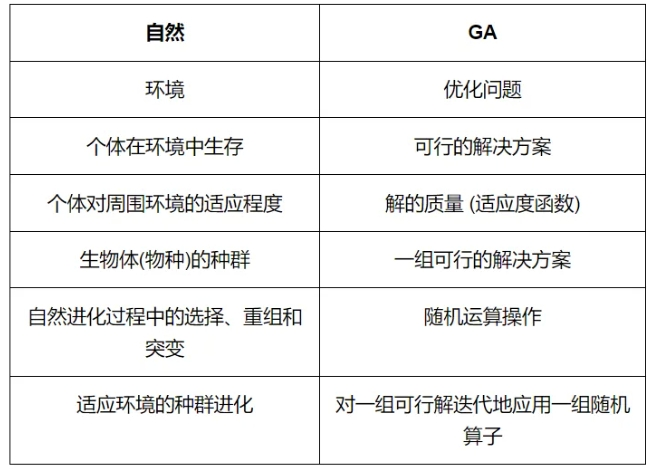


---
layout: top-title-two-cols
color: cyan
---

:: title ::
# 基本概念

:: left ::

- **种群**：由多个个体组成的集合，表示可行解集合。
- **个体**：表示单个候选解。
- **染色体**：候选解的编码，是其在算法的表现形式。
- **基因**：编码的分量，染色体的基本单位。
- **适应度**：问题域中的表现，评价个体好坏的标准。
- **算子**：遗传算法中的操作。
    - **选择**：按照个体的适合程度选择较为合适的个体，将它们的优秀基因遗传下去。
    - **交叉**：两个个体的染色体随机交换部分基因，主要作用是提供解的混合和子空间中的收敛。
    - **变异**：随机的改变基因的某点或某部分，增加种群多样性，并提供逃离局部最优化的机制。

:: right ::


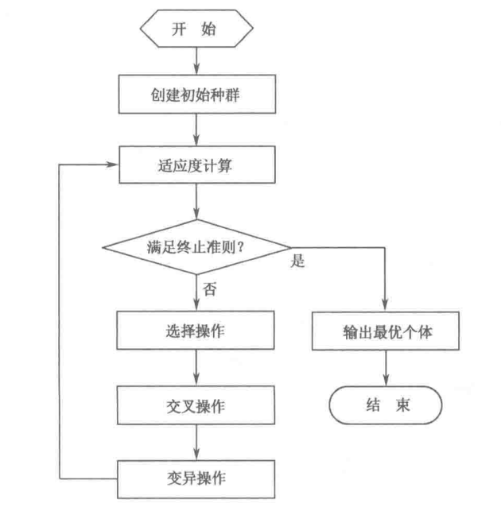

---
layout: top-title-two-cols
color: cyan
align: l-lt-lt
columns: is-5
---

:: title ::
# 编码方式

:: left ::

GA求解问题不是直接作用在问题的解空间上而是利用解的某种编码表示。


<AdmonitionType type="important">
编码是指在GA中如何描述问题的可行解，即把一个问题的可行解从其解空间转换到GA所能处理的搜索空间的转换方法。

其很大程度上决定了如何进行群体的遗传运算及其运算效率。一个好的编码方案可以使遗传运算简单地实现和执行；否则可能使运算难以实现。
</AdmonitionType>


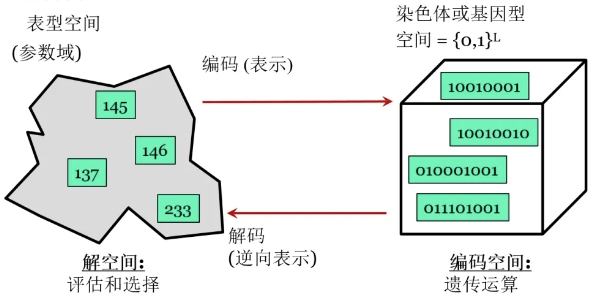 { width=400 }

以下介绍均以二进制编码为例。

:: right ::

应用较多的编码方案有二进制编码、实数编码、矩阵编码、树型编码和量子比特编码方案。

- 二进制编码：二进制编码使用二值编码符号集$\{0,1\}$，每个个体是一个二进制符号串。
  - 编码、解码操作简单易行；遗传操作便于实现。
  - 可能无法反映结构特征和特定信息或很难描述问题性质
  - 解的精度受编码长度控制。编码较短时可能达不到精度要求；编码较长时会使搜索空间急剧扩大。
- 实数编码：对于高维、连续优化问题，由于从一个连续量离散化为一个二进制量本身存在误差，经常采用实数编码方式。
- 矩阵编码：一维编码方案无法简单地表示各种组合情况，如组合服务、循环路径、多任务等，采用矩阵的形式来对个体进行编码。

---
layout: top-title
color: cyan
---

:: title ::
# 解码与适应度函数

:: content ::
适应度即生物群体中个体适应生存环境的能力。用来评价个体优劣的数学函数，称为个体的适应度函数。

遗传算法在进化搜索中基本上不用外部信息，仅以适应度函数为依据，通过编码后的染色体得到结果。

它的目标函数不受连续可微的约束，且定义域可以为任意集合。对适应度函数的唯一要求是，针对输入可计算出能进行比较的结果。这一特点使得遗传算法应用范围很广。

在具体应用中，适应度函数的设计要结合求解问题本身的要求而定。适应度函数评估是选择操作的依据，适应度函数设计直接影响到遗传算法的性能。

常见的适应度函数构造方法主要有：目标函数映射成适应度函数，基于序的适应度函数等。


---
layout: top-title
color: cyan
---

:: title ::
# 算子：交叉 CrossOver

:: content ::

- 单点交叉：在染色体中选择一个切点，然后将其中一部分同另一个染色体的对应部分进行交换得到两个新的个体。

- 多点交叉：在染色体中选择多个切点，对其任意两个切点之间部分以较大的概率$P_c$进行交换。

- 均匀交叉：染色体任意对应的位置以一定的概率进行交换得到新的个体。

<div style="display: flex; justify-content: space-around; align-items: center;">
    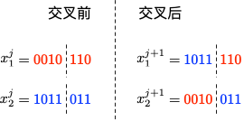
    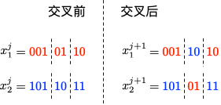
    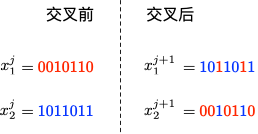
</div>

```cpp {all|1,2|4,5|all}
Individual crossOver(Individual father, Individual mother) { // 交叉
	  Chromosome child = ""; // 子代染色体
	  for (int i = 0; i < len; i ++ ) {
	  	  if (((double) random(0, 100) / 100) <= 0.5) child += father.chromosome[i]; // 一半概率来自父亲
	  	  else child += mother.chromosome[i]; // 另一半来自母亲
	  }
	  return Individual(child);
}
```

---
layout: top-title
color: cyan
---

:: title ::
# 算子：变异 Mutation

:: content ::
即低概率地随机地改变某个基因。这样可以有效避免程序陷入局部最优或者过慢收敛。

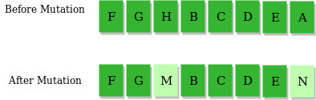

```cpp
void mutation(Individual &ind) { // 变异
    int P = random(1, 2), LEN = ind.size();
    for (int i = 1; i <= P; i ++ ) {
        int pos = random(0, LEN - 1);
        ind->chromosome[pos] = mutate();
    }
}
```

---
layout: top-title-two-cols
columns: is-8
align: l-lt-lt
color: cyan
---

:: title ::
# 算子：选择 Selection

:: left ::

在种群中按照一定的策略或概率，选择一部分个体，将他们的基因遗传下去，这里的策略一般是按照适应度的大小，选择更为优秀的个体进行遗传，但这有部分可能会使我们的求解过程陷入一个局部最优而最终不能得到全局最优解。

一种常用的策略是==轮盘赌==，即按照适应度的大小，将适应度转化为概率，然后按照这个概率选择个体。

对于种群中的每个个体，计算其适应度，记第$i$个个体的适应度为$F_i=f(x_i)$。则个体在一次选择中被选中的概率为：

$$P_i = \frac{F_i}{\sum_{j=1}^{N} F_j}$$

为了保证种群的数量不变，我们需要重复$n$次选择过程，单次选择采用轮盘赌的方法。利用计算得到的被选中的概率计算每个个体的累积概率：

$$Q_0 = 0, Q_i = \sum_{j=1}^{i} P_j$$

每次选择时随机生成$r \in [0,1]$，当$r \in [Q_{i-1}, Q_i]$时，选择第$i$个个体。

:: right ::

选择的过程如同在下图的轮盘上安装一个指针并随机旋转，每次指针停止的位置的即为选择的个体。

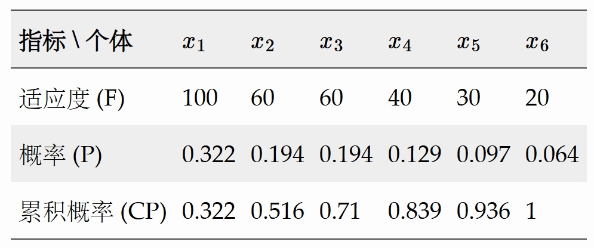 {width=350}
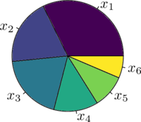 {width=350}


---
layout: top-title
color: cyan
---

:: title ::
# 小结

:: content ::
1. 对于不同的问题，需要选择适合的编码方式与适应度函数。

2. 在整个遗传运算的过程中，不同的操作发挥着不同的作用：

    - 选择：优胜劣汰，适者生存。
    - 交叉：丰富种群，持续优化。
    - 变异：随机扰动，避免局部最优。

3. 此外，仍有一些超参数需要人为设定、调整，如种群大小、交叉概率、变异概率等。
---
layout: top-title
color: yellow
---

:: title ::
# 直观体会：字符串的进化

:: content ::
给定一个目标字符串（$target$），目标是从相同长度的随机字符串开始生成目标字符串。

比如从 `114514QAQ` 生成 `123456789`。

- 染色体编码：直接使用一个长度固定的字符串，表示当前的数据。

- 适应度函数：比较当前染色体与目标字符串之间不同的字符个数即为适应度。显然，适应度越低越好。

- 初始化：生成一定数量的随机字符串。

---
layout: top-title
color: yellow
---

:: title ::
# 直观体会：字符串的进化

:: content ::
```cpp
int main() {
    for (int i = 0; i < POPULATION; i ++ ) population.emplace_back(Individual(create()));
    while (!found) {
        sort(population.begin(), population.end()); // 按照适应度排序
        printf("Generation: %d  ", cnt);
        cout << "String : " << population[0].chromosome << "  ";
        cout << "Fitness : " << population[0].fitness << "\n"; cnt ++ ;
        if (population[0].fitness == 0) { found = true; break; }
        vector<Individual> new_population;
        int s = (10 * POPULATION) / 100; // 保留精英种子
        for (int i = 0; i < s; i ++ )  
            new_population.emplace_back(population[i]);
        s = POPULATION - s; // 剩下的随机交配
        for (int i = 0; i < s; i ++ ) {
            int len = population.size();
            Individual p1 = population[random(0, 50)];
            Individual p2 = population[random(0, 50)];
            Individual ch = p1.mate(p2);
            int P = random(0, 100);
            if (P <= 20) ch.mutation();
            new_population.emplace_back(ch);
        }
        population = new_population;
    }
    return 0;
}
```

---
layout: top-title-two-cols
color: yellow
---

:: title ::
# 直观体会：字符串的进化

:: left ::

## 单次结果

``` text
Generation: 0   String : "'IalP?= VX_   Fitness : 10
Generation: 1   String : 9'ne;2.S JA\{  Fitness : 9
Generation: 2   String :  kvT W 1j!t!   Fitness : 8
Generation: 3   String :  kvT W\{1j!t!  Fitness : 8
Generation: 4   String :  'vT W 1j!t!   Fitness : 7
Generation: 5   String : Idve Y\{vIqt!  Fitness : 6
Generation: 6   String : I=ve7r;t nt!   Fitness : 5
Generation: 7   String : I've W 1jit!   Fitness : 4
Generation: 8   String : I've W 1jit!   Fitness : 4
Generation: 9   String : I'vT W t it!   Fitness : 3
Generation: 10  String : I'vT W t it!   Fitness : 3
Generation: 11  String : I've W t it!   Fitness : 2
Generation: 12  String : I've g 1 it!   Fitness : 2
Generation: 13  String : I've g t it!   Fitness : 1
Generation: 14  String : I've g t it!   Fitness : 1
Generation: 15  String : I've got it!   Fitness : 0
```

:: right ::

## 迭代次数统计

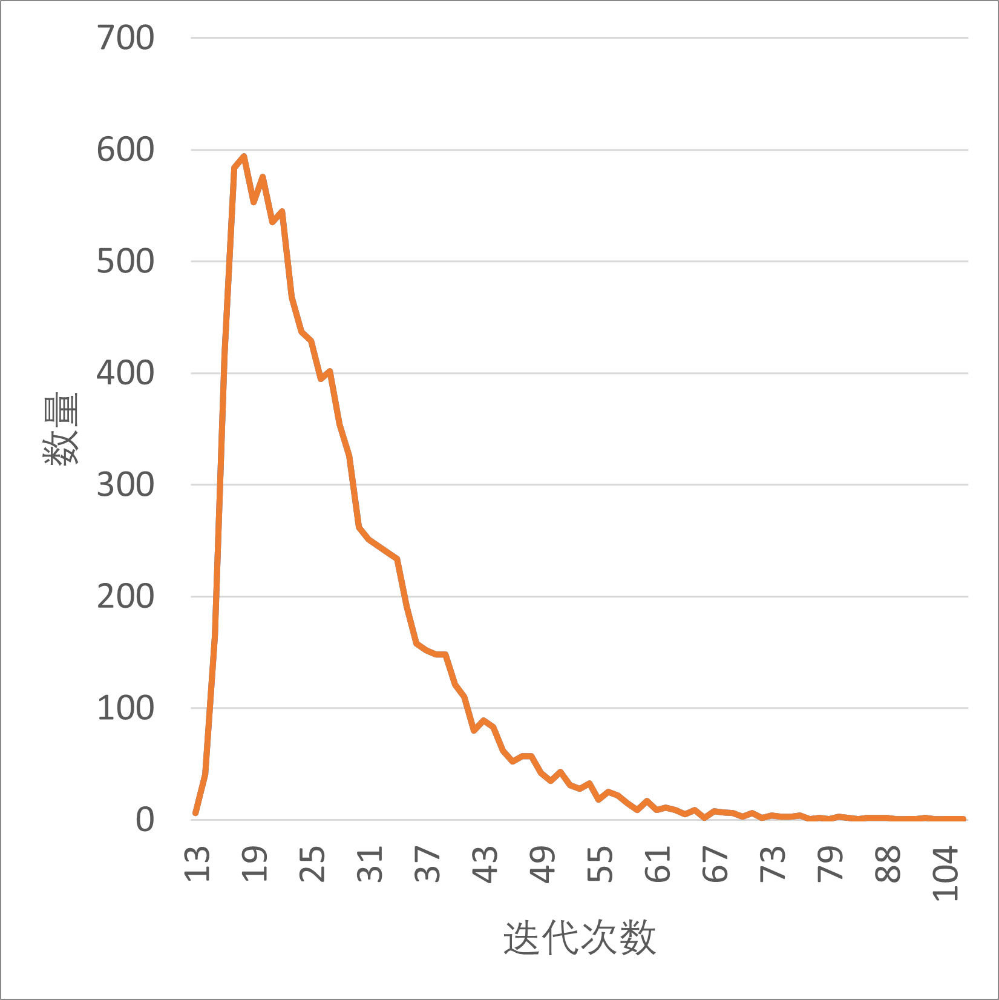

---
layout: top-title
color: yellow
---

:: title ::
# 简单应用：背包问题

:: content ::
```python
items_weights = [4, 2, 3, 1, 2]  # 物品的重量
items_values = [10, 4, 7, 2, 5]  # 物品的价值
max_weight = 7  # 背包的最大承重
def fitness_func(ga_instance, solution, solution_idx):
    weight = np.sum(solution * items_weights)
    value = np.sum(solution * items_values)
    if weight > max_weight:
        return 0
    return value

ga_instance = pygad.GA(
    num_generations=100,          num_parents_mating=5, 
    fitness_func=fitness_func,
    sol_per_pop=10, 
    num_genes=len(items_weights), gene_type=int,
    init_range_low=0,             init_range_high=2,
    parent_selection_type="sss",  crossover_type="single_point",
    mutation_type="random",       mutation_percent_genes=10
)
ga_instance.run()

solution, solution_fitness, solution_idx = ga_instance.best_solution()
print(f"最佳解决方案: {solution}")
print(f"最佳解决方案的总重量: {np.sum(solution * items_weights)}")
print(f"最佳解决方案的总价值: {np.sum(solution * items_values)}")
```

---
layout: top-title
color: red
---

:: title ::
# 数学理论基础

:: content ::
上面介绍的内容仅仅是遗传算法的基本流程。
- 但是经过这些仿生的操作能确保最终收敛吗？
- 如果收敛的话能够收敛到全局最优还是局部最优？
- 收敛到全局最优的概率是多少？

在遗传算法刚提出来的时候为不少问题找到了一个较好的解，对于很多问题都能找到一个比较好的解，但是缺乏数学理论基础的保证，往往会让人产生上面这些问题。

很多时候，实践的发展往往是超前于理论的，于是在遗传算法提出 5 年后，它的提出者便发表了==模式定理 Schema Theory==来说明遗传算法中发生 “优胜劣汰” 的原因。

而后又有人通过马氏链证明了算法的收敛性，结果是原始的遗传算法并不能收敛到全局最优，但是经过简单改进的遗传算法能够收敛到全局最优，这点在此不做讲解。

---
layout: top-title
color: red
---

:: title ::
# 模式定理的基本概念

:: content ::

模式定理是遗传算法的理论基础之一，它是由 John Holland 在 1975 年提出的。

在 $[0,31]$ 上求解方程$F(x) = x^2$的最大值，使用固定长度二进制编码对种群中的个体进行编码，在计算适应度值时会发现一个规律，当个体编码的最左边为$1$时，适应度普遍较大，可以记为 $1***1$，同理 $0****$ 的个体适应度偏低。由此可以引入以下一些基本概念:

**模式 (Schema)**：编码的字符串中具有类似特征的子集。 例如上述五位二进制字符串中，模式 $*111*$ 可代表 $4$ 个个体。个体和模式的一个区别就是，个体是由 $\{0，1\}$ 组成的编码串，模式是由 $\{0，1，*\}$ 组成，$*$ 为通配符。

**模式阶 (Schema Order)**：表示模式中已有明确含义的字符个数，记为 $o (s)$，$s$ 代表模式。例如 $o (111)=3$; 阶数越低，说明模式的概括性越强，所代表的编码串个体数也越多。其中阶数为零的模式概括性最强。

**模式定义长度 (Schema Defining Length)**：指第一个和最后一个具有含义的字符之间的距离，其可表示该模式在今后遗传操作中被破坏的可能性，越短则越小，长度为 $0$ 最难被破坏。


---
layout: top-title
color: red
---

:: title ::
# 模式定理：选择

:: content ::

假设当前是第$t$代， 这一代中模式$s$的个体数记为$m(s,t)$，整个种群的数目为$M$，个体${a_i}$的适应度为${f_i}$

则个体${a_i}$被选择的概率为${p_i} = \frac{f_i}{\sum_{j=1}^{M}{f_i}}$

因此经过选择后， 模式$s$在下一代的数目为$
m(s, t+1) = M \frac{m(s, t) \overline{f(s)}}{\sum_{j=1}^{M} f_j} = m(s, t) \frac{\overline{f(s)}}{\overline{f}}
$

其中$\overline{f(s)}$表示模式$s$中个体的平均适应度,$\overline{f}$表示整个种群的平均适应度，也就是$\bar{f} = \frac{\sum_{j=1}^{M} f_j}{M}$

设$\overline{f(s)} = (1 + c) \overline{f}$，即$s$的平均适应度是种群适应度的$1 + c$倍，则只有$c > 0$，$s$中的个体才能增长，有
$$m(s, t+1) = m(s, t) \frac{f(s)}{\overline{f}} = m(s, t) \frac{(1+c)\overline{f}}{\overline{f}} = m(s, t)(1+c)$$

则从开始到第$t+1$代，模式s的个体的数目为:
$$m(s, t+1) = m(s, 1){(1+c)}^{t}$$

可以看到当**模式平均适应度高于种群适应度时，模式中的个体会呈指数形式增长**。

---
layout: top-title
color: red
---

:: title ::
# 模式定理：交叉

:: content ::
记模式定义长度 (schema defining length)：第一个和最后一个具有含义的字符之间的距离 为$\delta(s)$，染色体的长度记为 $\lambda$

则模式被破坏，也就是在定义长度内进行交叉的概率为$p_d = \frac{\delta(s)}{\lambda - 1}$

因此模式存活的概率为$p_s = 1 - p_d = 1 - \frac{\delta(s)}{\lambda - 1}$

假设超参数交叉概率为$p_c$，则存活概率为$p_s = 1 - p_c \frac{\delta(s)}{\lambda - 1}$

在经过选择，交叉后，模式$s$在下一代数目为
$$
m(s, t+1) = m(s, t) \frac{\overline{f(s)}}{\overline{f}} \left[1 - p_c \frac{\delta(s)}{\lambda - 1}\right]
$$

从这里可以看到，**模式的定义长度 (schema defining length) 越小，则其存活的概率越大**

---
layout: top-title
color: red
---

:: title ::
# 模式定理：变异

:: content ::
记模式的阶 (Schema Order)：已有明确含义的字符个数为$o(s)$，超参数变异概率为$p_m$

则原来的基因存活，也就是那些确定的位置都不发生变异的概率为
$$
p_s = (1 - p_m)^{o(s)} \approx 1 - p_m o(s) \quad \text{当} p_m \ll 1 \text{时}
$$

上式最后做了泰勒展开，因此经过选择，交叉和变异后，模式$s$在下一代种群的数目为
$$
m(s, t+1) = m(s, t) \bar{\frac{f(s)}{\overline{f}}} \left[ 1 - p_c \frac{\delta(s)}{\lambda - 1} - p_m o(s) \right]
$$

从上式也可以看到，**模式的阶越低，模式越容易存活**。

---
layout: top-title
color: red
---

:: title ::
# 模式定理：总结

:: content ::
因此经过上面的分析，可以得到模式定理的定义：

$$
m(s, t+1) = m(s, t) \bar{\frac{f(s)}{\overline{f}}} \left[ 1 - p_c \frac{\delta(s)}{\lambda - 1} - p_m o(s) \right]
$$

**适应度高于群体平均适应度的（$\bar{\frac{f(s)}{\overline{f}}}$较大），长度较短（$\delta(s)$较小），低阶（$o(s)$较小）的模式在遗传算法的迭代过程中将按指数规律增长**

可以理解为，有一些特定的个体种类（比较优秀的），在代代遗传的过程中，会向着全局最优解越来越快地收敛。

上述“适应度高于群体平均适应度的，长度较短，低阶的模式”被定义为积木块。（因为它们又短、又零星散乱）。

遗传算法通过“积木块”，在遗传操作作用下相互结合，最终会接近全局最优解。这就是所谓的积木块猜想（building-block hypothesis）。

该定理阐明了遗传算法中发生 “优胜劣汰” 的原因。在遗传过程中能存活的模式都是定义长度短、阶次低、平均适应度高于群体平均适应度的优良模式。遗传算法正是利用这些优良模式逐步进化到最优解。

---
layout: top-title
color: lime
---

:: title ::
# 策略改进：精英保留策略 Elitism

:: content ::

虽然上面的模式定理说明了遗传算法有 “优胜劣汰” 的趋势，但是对于其收敛性并没有给出一个证明。
> `Convergence Analysis of Canonical Genetic Algorithms` 对遗传算法的收敛性进行了证明。
> 
> 证明利用了有限状态的时齐马氏链的遍历性和平稳分布的性质，因为遗传算法可以被描述成一个有限状态的时齐马氏链，假如种群大小为 $M$, 染色体的长度为 $\lambda$, 采用 01 编码方式，将所有个体的染色体连起来作为一个状态，则种群的所有状态数目为 $2^{M\lambda}$。同时选择概率，变异概率和交叉概率可作为状态转移概率。

1. 选择、交叉和变异中都带有一定的随机性，导致了最优解可能会被抛弃，传统遗传算法不能收敛到全局最优。
2. 在传统的遗传算法基础上每次选择的时候保留前面所有迭代里面的最优个体，最终能收敛到全局最优。

因此，使用==精英保留策略==通过保留当前代中最优秀的个体，可以防止遗传操作导致最优解丧失，保证解的质量不会随着代数增加而下降；另一方面可以加速收敛。

但，过强的精英保留策略可能会导致算法陷入局部最优，导致过早收敛。

```cpp
void elitism() {
    // before selection, crossover and mutation
    sort(population.begin(), population.end());
    for (int i = 0; i < ELITISM; i ++ ) {
        new_population.emplace_back(population[i]);
    }
}
```

---
layout: top-title
color: lime
---
:: title ::
# 二进制编码的固有问题：汉明距离过长

:: content ::

在我们继续之前，让我们介绍一下汉明距离（Hamming distance）的基本概念，它是两个等长的串之间的距离度量。

实质上，汉明距离是两个字符串中相应字符不同的符号或位置的数量。换句话说，如果从一个字符串开始，那么需要更换为另一个字符串的替换或替换的最小数量。

例如，theory 和 memory 之间的汉明距离是 3，因为只有前三个字符是不同的。1234567 和 1122117 之间的汉明距离是 5。

二进制编码的缺点是汉明悬崖（Hamming Cliff），就是在某些相邻整数的二进制代码之间有很大的汉明距离，使得遗传算法的交叉和突变都难以跨越。

如：${7}_{10} = 0111_2$ 和 ${8}_{10} = 1000_2$ 之间的汉明距离是 4，而 ${7}_{10} = 0111_2$ 和 ${9}_{10} = 1001_2$ 之间的汉明距离是 3。

---
layout: top-title-two-cols
color: lime
columns: is-5
align: l-lt-lt
---

:: title ::
# 编码改进：格雷码

:: left ::

格雷码是一种与普通二进制码不同的二进制编码，它的每一个数字都与前一个数字仅有一位二进制位的差异。

<strong>转换公式</strong>

假设一个 n 位的二进制数 
$$B = b_{n-1} b_{n-2} \dots b_1 b_0$$

它的格雷码 G 可以通过以下公式生成：

$G_n = B_n$（最高位不变）

$G_i = B_i \oplus B_{i+1}$ （对于每一位 i，格雷码的 i 位是二进制数 i 位与 i+1 位的异或）


:: right ::
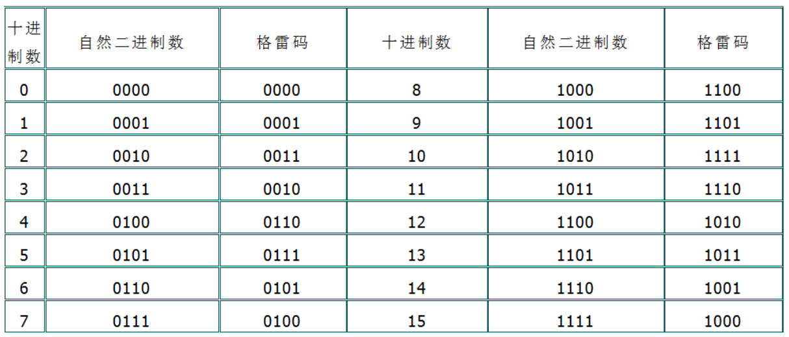

1. 平滑变异：保证了每次变异后，只有一个比特位的变化，避免了大幅度的解空间跳跃。
2. 提高收敛性：平滑的解空间过渡有助于更快地收敛到最优解。
3. 稳定性增强：减少了因变异和交叉操作引起的解不稳定，提升了算法的稳定性。

---
layout: top-title
color: lime
---
:: title ::
# 其他改进方向

:: content ::
- **自适应参数**：在遗传算法的迭代过程中，通过对种群中个体的适应度进行实时监测，动态调整交叉概率、变异概率等参数，以提高算法的搜索效率。
- **多种群遗传算法**：引入距离度量或罚函数，将种群分为多个子种群，每个子种群独立进化，通过子种群间的信息交流，提高算法的全局搜索能力。
- **遗传算法与其他算法的结合**：将遗传算法与其他优化算法结合，形成混合算法，以克服各自的缺点，提高算法的搜索效率。
- **并行遗传算法**：引入岛模型、群体模型等并行计算模型，提高算法的搜索效率。

---
layout: top-title-two-cols
color: blue
---

:: title ::
# 一些有趣的应用

:: left ::
以 旅行商问题 为例，利用 GA 算法求解中国 34 个省会城市的TSP问题。求解代码利用了 Deap 库，结果可视化如下图所示：
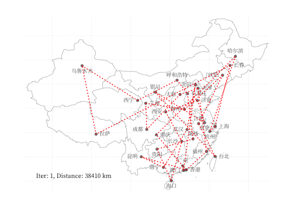

:: right ::

利用 GA 算法，使用不同颜色和透明度的多边形的叠加表示一张图片，在线体验详见[此处](http://alteredqualia.com/visualization/evolve/)，下图为不同参数下的蒙娜丽莎图片的表示情况：
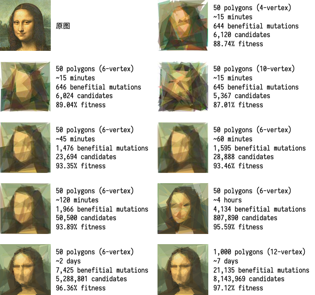

---
layout: top-title
color: blue
---

:: title ::
# 应用：旅行商问题

:: content ::

主要是也没时间再研究其他的应用了，所以就以旅行商问题为例😓。

旅行商问题（TSP）是一个经典的组合优化问题，目标是找到一条最短的路径，使得旅行商可以访问所有城市并返回起点，已被证明是 NP 难问题。

对于遗传算法：
- 编码：采用顺序（整数）编码，即将城市的访问顺序作为染色体。
- 适应度函数：在指定的城市的访问顺序下，路径的总长度。
- 选择：轮盘赌选择 + 精英保留策略。
- 交叉：顺序交叉。
- 变异：两点交换变异。
- 终止条件：迭代次数达到上限或者适应度达到阈值。

---
layout: top-title
color: blue
---

:: title ::
# 应用：旅行商问题

:: content ::
```python
# calculating distance of the cities
def calcDistance(cities):
    total_sum = 0
    for i in range(len(cities) - 1):
        cityA = cities[i]
        cityB = cities[i + 1]

        d = math.sqrt(
            math.pow(cityB[1] - cityA[1], 2) + math.pow(cityB[2] - cityA[2], 2)
        )

        total_sum += d

    cityA = cities[0]
    cityB = cities[-1]
    d = math.sqrt(math.pow(cityB[1] - cityA[1], 2) + math.pow(cityB[2] - cityA[2], 2))

    total_sum += d

    return total_sum
```

---
layout: top-title
color: blue
---

:: title ::
# 应用：旅行商问题

:: content ::
```python
def geneticAlgorithm(generation, population, lenCities, TOURNAMENT_SELECTION_SIZE, MUTATION_RATE, CROSSOVER_RATE, TARGET):
    gen_number = 0
    process = [0 for i in range(generation+1)]
    for i in range(1, generation+1):
        new_population = [sorted(population)[0], sorted(population)[1]]
        for i in range(int((len(population) - 2) / 2)):
            # CROSSOVER
            random_number = random.random()
            if random_number < CROSSOVER_RATE:
                parent_chromosome1 = sorted(random.choices(population, k=TOURNAMENT_SELECTION_SIZE))[0]
                parent_chromosome2 = sorted(random.choices(population, k=TOURNAMENT_SELECTION_SIZE))[0]
                point = random.randint(0, lenCities - 1)
                child_chromosome1 = parent_chromosome1[1][0:point]
                for j in parent_chromosome2[1]:
                    if (j in child_chromosome1) == False:
                        child_chromosome1.append(j)
                child_chromosome2 = parent_chromosome2[1][0:point]
                for j in parent_chromosome1[1]:
                    if (j in child_chromosome2) == False:
                        child_chromosome2.append(j)
            # If crossover not happen
            else:
                child_chromosome1 = random.choices(population)[0][1]
                child_chromosome2 = random.choices(population)[0][1]
```
---
layout: top-title
color: blue
---

:: title ::
# 应用：旅行商问题

:: content ::
```python
            # MUTATION
            if random.random() < MUTATION_RATE:
                point1 = random.randint(0, lenCities - 1)
                point2 = random.randint(0, lenCities - 1)
                child_chromosome1[point1], child_chromosome1[point2] = (child_chromosome1[point2],child_chromosome1[point1])

                point1 = random.randint(0, lenCities - 1)
                point2 = random.randint(0, lenCities - 1)
                child_chromosome2[point1], child_chromosome2[point2] = (child_chromosome2[point2],child_chromosome2[point1])
            new_population.append([calcDistance(child_chromosome1), child_chromosome1])
            new_population.append([calcDistance(child_chromosome2), child_chromosome2])
        population = new_population
        gen_number += 1
        if gen_number % 10 == 0:
            print(gen_number, sorted(population)[0][0])
        process[gen_number] = sorted(population)[0][0]
        if sorted(population)[0][0] < TARGET:
            break
    answer = sorted(population)[0]
    return answer, gen_number, process
```

---
layout: top-title-two-cols
color: blue
---

:: title ::
# 应用：旅行商问题

:: left ::
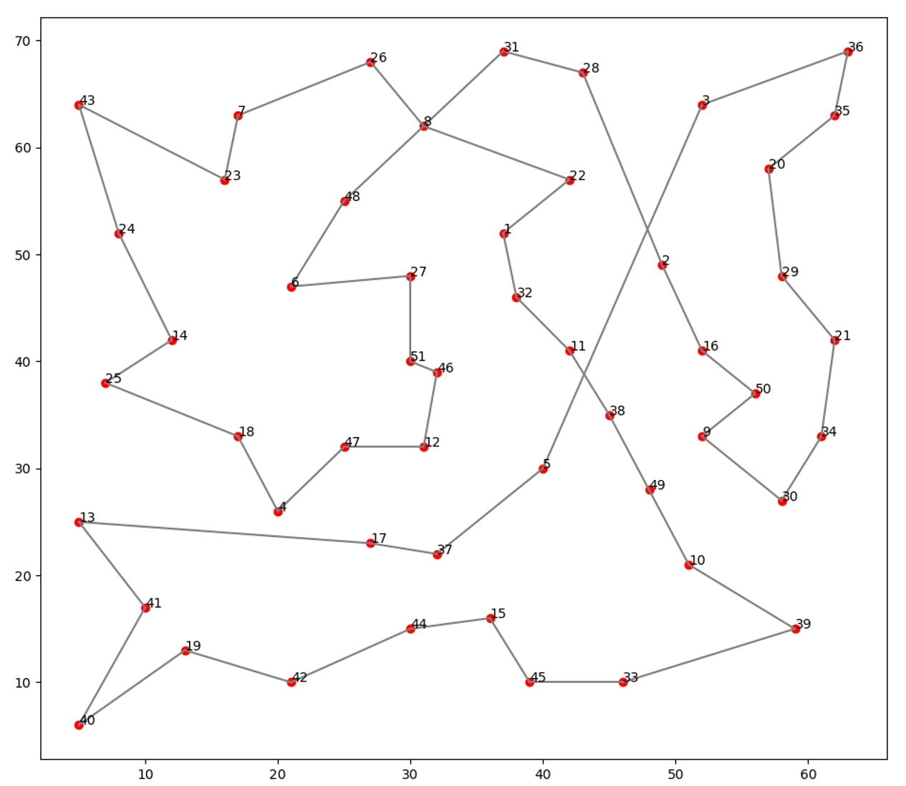 {width=800}

:: right ::
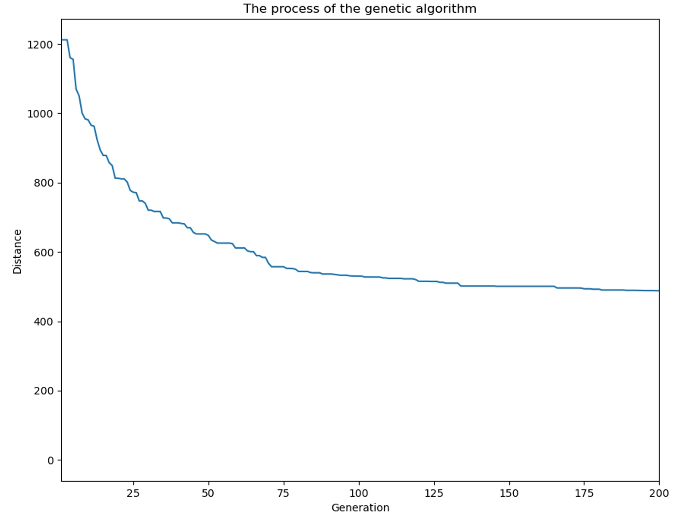 {width=800}

---
layout: side-title
side: left
color: lime
titlewidth: is-3
align: rm-lt
---

:: title ::

# <mdi-math-integral-box /> 参考资料

References


:: content ::

1. 汪定伟, 王俊伟, 王洪峰, 张瑞友, & 郭哲. (2007). 智能优化方法. 高等教育出版社.
2. 范叶亮. (2019). [启发式算法 (Heuristic Algorithms)](https://leovan.me/cn/2019/04/heuristic-algorithms)
3. Xin-She Yang. (2014). Nature-Inspired Optimization Algorithms. Elsevier.
4. 张超群, 郑建国, 钱洁. 遗传算法编码方案比较[J]. 计算机应用研究, 2011, 28 (03): 819-822.
5. 边霞, 米良. 遗传算法理论及其应用研究进展[J]. 计算机应用研究, 2010, 27 (07): 2425-2429+2434.
6. 席裕庚，柴天佑，恽为民. 遗传算法综述[J]. 控制理论与应用, 1996, (06):
7. 吴良超. (2017) [遗传算法简介.](https://wulc.me/2017/04/10/%E9%81%97%E4%BC%A0%E7%AE%97%E6%B3%95%E7%AE%80%E4%BB%8B/#%E7%90%86%E8%AE%BA%E5%9F%BA%E7%A1%80) 吴良超的学习笔记.
8. Link-Cut-Y. (2023). [浅谈遗传算法.](https://www.cnblogs.com/Link-Cut-Y/p/17281139.html) cnblogs.
9. Michael Herrmann. (2011). [The Schema Theorem and the Building Block Hypothesis](https://www.inf.ed.ac.uk/teaching/courses/nat/slides/nat04.pdf). University of Edinburgh.